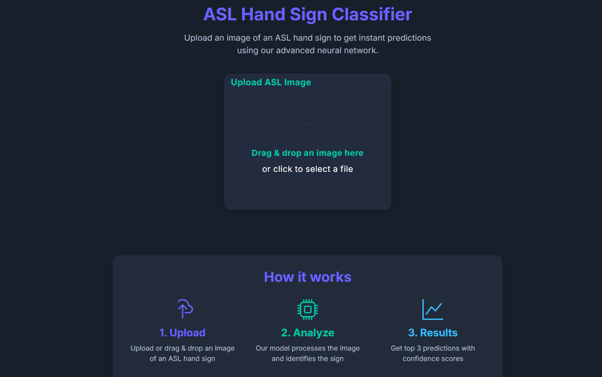
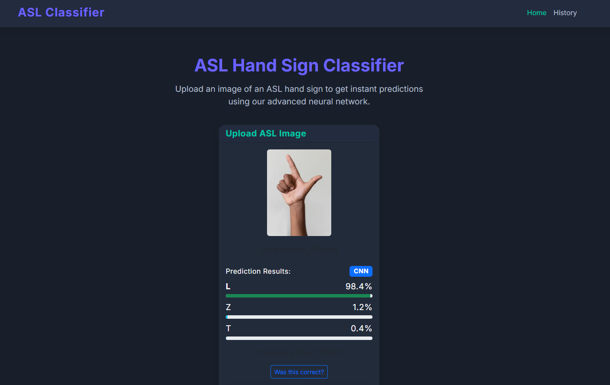
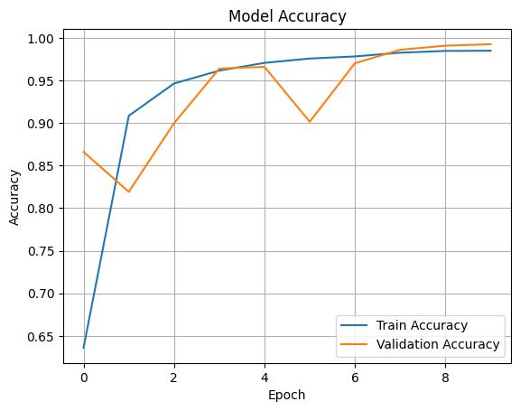

# ASL Alphabet Recognition System

Un système complet de reconnaissance de l'alphabet de la langue des signes américaine (ASL) utilisant l'apprentissage profond avec deux modèles CNN distincts : un CNN personnalisé et un modèle de transfer learning VGG16.

## Vue d'ensemble

Ce projet fournit une reconnaissance ASL en temps réel via une interface web moderne. Les utilisateurs peuvent télécharger des images de signes ASL et obtenir des prédictions de deux modèles d'IA différents :

- **CNN Personnalisé** : Modèle léger et rapide entraîné from scratch (60x60 grayscale)
- **VGG16 Transfer Learning** : Modèle plus précis utilisant des poids pré-entraînés (224x224 RGB)

## Structure du Projet

```
ProjetIA/
├── backend/               # Serveur FastAPI
│   ├── app/
│   │   ├── main.py       # Application FastAPI principale
│   │   ├── routes.py     # Endpoints API (/health, /predict, /feedback)
│   │   ├── ml_service.py # Service de machine learning
│   │   ├── models.py     # Modèles Pydantic
│   │   ├── config.py     # Configuration et variables d'environnement
│   │   └── database.py   # Connexion MongoDB
│   ├── models/           # Modèles entraînés (.keras, .h5, .json)
│   └── requirements.txt  # Dépendances Python
├── frontend/             # Interface React TypeScript
│   ├── src/
│   │   ├── App.tsx       # Composant principal React
│   │   ├── api.ts        # Client API Axios
│   │   ├── components/   # Composants réutilisables
│   │   └── pages/        # Pages (Home, History)
│   └── package.json      # Dépendances Node.js
├── notebooks/            # Notebooks Jupyter pour l'entraînement
│   └── from-scratch-vgg.ipynb # Pipeline d'entraînement principal
├── asl_dataset/          # Données d'entraînement et de test
├── scripts/              # Scripts d'automatisation
└── image/                # Images pour la documentation
```

## Captures d'écran

### Interface de l'Application

*Interface principale de l'application de reconnaissance ASL*

### Résultats de Prédiction

*Exemple de résultats de prédiction ASL avec scores de confiance*

## Fonctionnalités

- **Prédiction Double Modèle** : Choix entre les modèles CNN et VGG16
- **Reconnaissance en Temps Réel** : Upload et prédictions instantanées
- **Comparaison de Modèles** : Comparaison des résultats des deux modèles
- **Historique des Prédictions** : Suivi des prédictions précédentes avec MongoDB
- **Système de Feedback** : Fournir des commentaires sur la précision des prédictions
- **API REST Complète** : API complète pour l'intégration avec d'autres applications

## Stack Technologique

### Backend
- **FastAPI** : Framework web Python moderne avec documentation automatique
- **TensorFlow/Keras** : Framework d'apprentissage profond
- **MongoDB** : Base de données pour stocker prédictions et feedback
- **OpenCV** : Traitement d'images et préprocessing
- **Uvicorn** : Serveur ASGI haute performance

### Frontend
- **React 18** : Bibliothèque JavaScript pour l'interface utilisateur
- **TypeScript** : JavaScript typé pour plus de sécurité
- **Bootstrap 5** : Framework CSS pour un design responsive
- **Axios** : Client HTTP pour les appels API
- **React Router** : Routage côté client

### Machine Learning
- **TensorFlow/Keras** : Entraînement et inférence de modèles
- **OpenCV** : Traitement d'images (cv2.imread, cv2.cvtColor, cv2.resize)
- **NumPy** : Calculs numériques et manipulation d'arrays
- **Matplotlib** : Visualisation des courbes d'entraînement

## Prérequis

- Python 3.8+
- Node.js 16+
- MongoDB (instance locale ou cloud)
- Git

## Installation

### 1. Cloner le Dépôt

```bash
git clone https://github.com/youcisla/ASL-AI.git
cd ProjetIA
```

### 2. Configuration du Backend

```bash
# Naviguer vers le répertoire backend
cd backend

# Créer un environnement virtuel
python -m venv venv

# Activer l'environnement virtuel
# Sur Windows :
venv\Scripts\activate
# Sur macOS/Linux :
source venv/bin/activate

# Installer les dépendances
pip install -r requirements.txt
```

### 3. Configuration du Frontend

```bash
# Naviguer vers le répertoire frontend
cd frontend

# Installer les dépendances
npm install
```

### 4. Configuration des Modèles

Placer les modèles entraînés dans le répertoire `backend/models/` :

```
backend/models/
├── custom_cnn_asl_model.keras        # Modèle CNN personnalisé
├── custom_cnn_labels.json            # Mapping des labels CNN
├── vgg16_transfer_asl_final.keras    # Modèle VGG16
└── vgg16_transfer_labels.json        # Mapping des labels VGG16
```

### 5. Configuration de l'Environnement

Créer un fichier `.env` dans le répertoire racine :

```env
# Base de données
MONGO_URI=mongodb://localhost:27017
MONGO_DB=asl_classifier

# Configuration API
ALLOWED_ORIGINS=http://localhost:5173,http://localhost:3000
MAX_FILE_SIZE_MB=10

# Chemins des modèles
CNN_MODEL_PATH=./models/custom_cnn_asl_model.keras
CNN_LABELS_PATH=./models/custom_cnn_labels.json
VGG_MODEL_PATH=./models/vgg16_transfer_asl_final.keras
VGG_LABELS_PATH=./models/vgg16_transfer_labels.json

# Stockage
UPLOADS_DIR=uploads
```

## Lancement de l'Application

### Option 1 : Utilisation des Scripts (Recommandé)

```bash
# Démarrer le backend
.\scripts\start_backend.bat    # Windows
./scripts/start_backend.sh     # macOS/Linux

# Démarrer le frontend (dans un nouveau terminal)
.\scripts\start_frontend.bat   # Windows
./scripts/start_frontend.sh    # macOS/Linux
```

### Option 2 : Commandes Manuelles

#### Démarrer le Serveur Backend

```bash
cd backend
uvicorn app.main:app --reload --host 0.0.0.0 --port 8000
```

#### Démarrer le Serveur de Développement Frontend

```bash
cd frontend
npm run dev
```

## Utilisation

1. **Accéder à l'Application** : Ouvrir le navigateur sur `http://localhost:5173`

2. **Télécharger une Image** : 
   - Glisser-déposer une image d'alphabet ASL
   - Ou cliquer pour sélectionner un fichier

3. **Choisir le Modèle de Prédiction** :
   - Cliquer "Predict with CNN" pour une prédiction rapide
   - Cliquer "Predict with VGG16" pour une prédiction plus précise

4. **Voir les Résultats** :
   - Voir les 3 meilleures prédictions avec scores de confiance
   - Voir le temps de traitement
   - Fournir un feedback sur la précision

## Endpoints API

### Vérification de Santé
```
GET /health                     # État du système et des modèles
```

### Prédictions
```
POST /api/predict/cnn          # Prédiction avec modèle CNN
POST /api/predict/vgg          # Prédiction avec modèle VGG16
POST /api/predict              # Prédiction par défaut (CNN)
```

### Labels
```
GET /api/labels                # Obtenir tous les labels (CNN)
GET /api/labels/cnn            # Obtenir les labels du modèle CNN
GET /api/labels/vgg            # Obtenir les labels du modèle VGG16
```

### Feedback et Historique
```
POST /api/feedback             # Soumettre un feedback de prédiction
GET /api/history               # Obtenir l'historique des prédictions
```

## Entraînement des Modèles

Le notebook Jupyter pour l'entraînement des modèles est situé dans `notebooks/from-scratch-vgg.ipynb`. Il contient le pipeline complet d'apprentissage automatique depuis le préprocessing des données jusqu'au déploiement des modèles.

### Pipeline d'Entraînement Détaillé

#### 1. Chargement des Données (`loadTrsinData`)

**Fonction de Chargement :**
```python
def loadTrsinData(trainDir, imageWidth, imageHight):
    classes = os.listdir(trainDir)
    imagesList = []
    labels = []
    for clas in tqdm.tqdm(classes):
        classesPath = os.path.join(trainDir, clas)
        for image in os.listdir(classesPath):
            imgPath = os.path.join(trainDir, clas, image)
            img = cv2.imread(imgPath)
            img = cv2.cvtColor(img, cv2.COLOR_BGR2GRAY)
            img = cv2.resize(img, (imageWidth, imageHight))
            imagesList.append(img)
            labels.append(clas)
    return imagesList, labels
```

**Caractéristiques :**
- Chargement de ~87,000 images d'entraînement
- 29 classes ASL (A-Z, space, delete, nothing)
- Pipeline : BGR → Grayscale → Resize (60x60)
- Structure : `/trainDir/classe/image.jpg`

#### 2. Exploration des Données (`displaySampleOfData`)

**Visualisation :**
```python
def displaySampleOfData(trainDir, imageWidth, imageHight):
    plt.figure(figsize=(10,15))
    classes = os.listdir(trainDir)
    for i,clas in enumerate(classes):
        plt.subplot(6,5,i+1)
        # Affichage d'un échantillon de chaque classe
```

**Objectif :** Grille 6×5 affichant un échantillon de chaque classe ASL pour validation visuelle

#### 3. Préprocessing des Données

**Normalisation et Reshape :**
```python
# Mélange pour éviter les biais
XShuffled, yShuffled = shuffle(X, y, random_state=42)

# Conversion et normalisation
xtrain = np.array(XShuffled).astype('float32') / 255.0
xtrainReshaped = xtrain.reshape((87000, 60, 60, 1))

# Encodage des labels
ytrain = to_categorical(ytrain)
```

**Étapes clés :**
- Shuffle avec `random_state=42` pour reproductibilité
- Normalisation [0,255] → [0,1] pour stabilité d'entraînement
- Reshape pour format CNN : `(87000, 60, 60, 1)`
- One-hot encoding pour classification multi-classes

#### 4. Architecture du Modèle CNN Personnalisé

**Structure du Modèle :**
```python
Model = Sequential([
    Conv2D(128, (3,3), activation='relu', input_shape=(60,60,1)),
    BatchNormalization(),
    MaxPooling2D((2,2)),
    Conv2D(64, (3,3), activation='relu'),
    BatchNormalization(),
    MaxPooling2D((2,2)),
    Conv2D(32, (3,3), activation='relu'),
    BatchNormalization(),
    MaxPooling2D((2,2)),
    Flatten(),
    Dense(256, activation='relu'),
    Dropout(0.2),
    Dense(128, activation='relu'),
    Dropout(0.15),
    Dense(64, activation='relu'),
    Dense(29, activation='softmax')
])
```

**Caractéristiques :**
- 3 couches convolutionnelles (128→64→32 filtres)
- BatchNormalization après chaque convolution
- MaxPooling2D pour réduction de dimensionnalité
- Dropout (0.2, 0.15) pour régularisation
- Dense layers : 256→128→64→29 neurones

#### 5. Configuration d'Entraînement

**Compilation et Callbacks :**
```python
Model.compile(optimizer='adam', loss='categorical_crossentropy', metrics=['accuracy'])

callbacks = [
    EarlyStopping(patience=3, restore_best_weights=True),
    ModelCheckpoint("best_custom_cnn.keras", save_best_only=True)
]

Model.fit(xtrainReshaped, ytrain, validation_split=0.2, epochs=10, callbacks=callbacks)
```

**Paramètres :**
- Optimiseur : Adam (adaptatif, momentum intégré)
- Loss : categorical_crossentropy (optimal pour multi-classes)
- Validation split : 20% (80% train, 20% validation)
- EarlyStopping : patience=3 pour éviter l'overfitting

#### 6. Courbes d'Entraînement


*Courbes d'accuracy du modèle CNN montrant la convergence d'entraînement et de validation*

**Analyse des Performances :**
```python
plt.plot(Model.history.history['accuracy'], label='Train Accuracy')
plt.plot(Model.history.history['val_accuracy'], label='Validation Accuracy')
plt.title('Model Accuracy')
plt.xlabel('Epoch')
plt.ylabel('Accuracy')
plt.legend()
plt.grid(True)
plt.show()
```

#### 7. Modèle VGG16 Transfer Learning

**Architecture VGG16 :**
```python
# Base VGG16 pré-entraînée (ImageNet)
base_model = VGG16(weights='imagenet', include_top=False, input_shape=(224,224,3))
for layer in base_model.layers:
    layer.trainable = False  # Geler les couches

# Tête de classification personnalisée
x = base_model.output
x = GlobalAveragePooling2D()(x)
x = Dense(256, activation='relu')(x)
x = Dropout(0.3)(x)
x = Dense(128, activation='relu')(x)
x = Dropout(0.2)(x)
predictions = Dense(29, activation='softmax')(x)
```

**Différences avec CNN :**
- Input : 224×224 RGB vs 60×60 grayscale
- Base pré-entraînée vs from scratch
- Learning rate : 1e-4 vs défaut Adam
- Callbacks avancés : ReduceLROnPlateau

#### 8. Sauvegarde des Modèles

**Formats Multiples :**
```python
# Modèle CNN
Model.save('custom_cnn_asl_model.keras')
Model.save('custom_cnn_asl_model.h5')

# Modèle VGG16
model.save('vgg16_transfer_asl_final.keras')
model.save('vgg16_transfer_asl_final.h5')

# Mappings de labels
with open('custom_cnn_labels.json', 'w') as f:
    json.dump(label_mapping, f)
```

**Fichiers Générés :**
- `.keras` : Format recommandé TensorFlow 2.x
- `.h5` : Format legacy pour compatibilité
- `.json` : Mapping index ↔ nom de classe

### Comparaison des Modèles

| Métrique | CNN Personnalisé | VGG16 Transfer |
|----------|------------------|----------------|
| Précision | ~85-90% | ~95-98% |
| Temps d'entraînement | 30-45 min | 60-90 min |
| Taille du modèle | ~50 MB | ~500 MB |
| Vitesse d'inférence | Rapide | Modérée |
| Format d'entrée | 60×60 grayscale | 224×224 RGB |
| Architecture | 3-layer CNN | VGG16 + Custom Head |

## Tests et Développement

### Lancement des Tests

```bash
# Tests backend
cd backend
pytest

# Tests API
python tests/test_api.py

# Validation des modèles
python tests/start_server.py
```

### Formatage du Code

```bash
# Linting frontend
cd frontend
npm run lint

# Formatage TypeScript
npm run format
```

## Dépannage

### Problèmes Communs

1. **Port Déjà Utilisé** :
   ```bash
   # Windows
   netstat -ano | findstr :8000
   taskkill /PID <PID> /F
   
   # macOS/Linux
   lsof -ti:8000 | xargs kill
   ```

2. **Erreur de Connexion MongoDB** :
   - Vérifier que MongoDB est en cours d'exécution
   - Vérifier la chaîne de connexion dans `.env`

3. **Erreur de Chargement de Modèle** :
   - Vérifier que les fichiers de modèles existent dans `backend/models/`
   - Vérifier les permissions de fichiers

4. **Problèmes de Dépendances** :
   ```bash
   # Recréer l'environnement virtuel
   rm -rf venv
   python -m venv venv
   pip install -r requirements.txt
   ```

## Déploiement

### Production avec Docker

```bash
# Construire l'image backend
docker build -t asl-backend ./backend

# Construire l'image frontend
docker build -t asl-frontend ./frontend

# Lancer avec docker-compose
docker-compose up -d
```

### Variables d'Environnement Production

```env
# Production
DEBUG=False
MONGO_URI=mongodb://prod-server:27017
ALLOWED_ORIGINS=https://your-domain.com
MAX_FILE_SIZE_MB=5
```

## Dataset

Le projet utilise le dataset ASL Alphabet contenant :
- **29 classes** : A-Z, space, delete, nothing
- **87,000 images d'entraînement** organisées par dossiers de classes
- **29 images de test** pour validation
- **Format** : Images JPG de signes de la main ASL

## Contributions

1. Fork le dépôt
2. Créer une branche de fonctionnalité
3. Effectuer vos modifications
4. Ajouter des tests pour les nouvelles fonctionnalités
5. Soumettre une pull request

## Licence

Ce projet est sous licence MIT. Voir le fichier LICENSE pour plus de détails.

## Remerciements

- Dataset ASL Alphabet de Kaggle
- Communautés TensorFlow et Keras
- Communautés FastAPI et React
- Équipe de développement ASL-AI

## Contact

Pour des questions ou du support, veuillez ouvrir une issue sur GitHub ou contacter les mainteneurs du projet.

---

*Développé avec ❤️ pour l'accessibilité et la reconnaissance de la langue des signes*